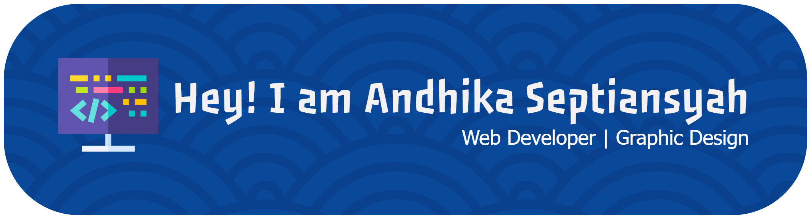

### Hi, I'm Andhika Septiansyah! 👋

A passionate **Web Developer** 💻 with experience building functional and intuitive web solutions. I have expertise in **HTML**, **CSS**, **JavaScript**, **PHP**, and **MySQL**, which I have applied to two main projects:

* **Go Rako Web:** A web management system for waste management. ♻️
* **Go Kantin:** A web application for food ordering. 🍔

With a strong background in **graphic design** using **Photoshop** for two years, I have a keen eye for visual details, ensuring each project not only functions well but also looks professional. 🎨 I gained this experience while working in photocopying, creating various designs such as invitations, stickers, and banners.

I'm always looking for opportunities to learn and collaborate on interesting projects. ✨ Let's build something great together!

##### Skill

##### Statistik

##### Connect With Me
    

